# **Traffic Sign Recognition** 


---

**Build a Traffic Sign Recognition Project**

The goals / steps of this project are the following:
* Load the data set given as part of the project
* Explore, summarize and visualize the data set
* Design, train and test a model architecture
* Use the model to make predictions on new images
* Analyze the softmax probabilities of the new images
* Summarize the results with a written report


## Rubric Points

#### Provide a Writeup / README that includes all the rubric points and how you addressed each one. You can submit your writeup as markdown or pdf. You can use this template as a guide for writing the report. The submission includes the project code.

Here I have considered all the RUBRIC points and given comments/explanations for each of these points)


### Data Set Summary & Exploration


#### 1. Provide a basic summary of the data set. In the code, the analysis should be done using python, numpy and/or pandas methods rather than hardcoding results manually.

I used the pickled data provided here with project for training, testing and validation. I used images downloaded from Internet to test the model to see if the model recognizes the new images. There are two sets of images with two different shapes used in this project.

        Training dataset includes 34799 entries
        Test 12630 entries 
        Validation 4410 entries
        
Data shape is 
         X train shape is  (34799, 32, 32, 3)
         Y train shape is  (34799,)
         X test shape is  (12630, 32, 32, 3)
         Y test shape is  (12630,)
         X valid shape is  (4410, 32, 32, 3)
         Y valid shape is  (4410,)

**a.  Load dataset from pickled data**
Load the data from picked data for all three datasets - training , testing and validation data. Load the features and labels into two separate arrays for each of these environment. ensure that X and Y arrays are of same length.  List the shape of the data

```python
# load pickled data consisting of three environments
import pickle
import random
import matplotlib.pyplot as plt
import matplotlib.image as mpimg
import numpy as np

#enable inline visualization
%matplotlib inline


training_data = "./data/train.p"
testing_data = "./data/test.p"
valid_data = "./data/valid.p"

with open(training_data,mode='rb') as f:
    train = pickle.load(f)
with open(testing_data,mode='rb') as f:
    test = pickle.load(f)
with open(valid_data,mode='rb') as f:
    valid = pickle.load(f)
    

X_train,Y_train = train['features'],train['labels']
X_test,Y_test = test['features'],test['labels']
X_valid,Y_valid = valid['features'],valid['labels']

assert(len(X_train) == len(Y_train))
assert(len(X_valid) == len(Y_valid))
assert(len(X_test) == len(Y_test))


print(" X train shape is ", X_train.shape)
print(" Y train shape is ", Y_train.shape)
print(" X test shape is ", X_test.shape)
print(" Y test shape is ", Y_test.shape)
print(" X valid shape is ", X_valid.shape)
print(" Y valid shape is ", Y_valid.shape)
   
```

     X train shape is  (34799, 32, 32, 3)
     Y train shape is  (34799,)
     X test shape is  (12630, 32, 32, 3)
     Y test shape is  (12630,)
     X valid shape is  (4410, 32, 32, 3)
     Y valid shape is  (4410,)


#### 2. Include an exploratory visualization of the dataset.

First print a random image to check if the data is loaded correctly. Explore the data to

1. Get the number of entries for each of the environment
2. Select randomly 10 images and display the images
3. Create a histogram by Label frequency to understand the frequency distribution of the data by various classes


```python
# print a random image

image_num = random.randint(0,len(X_train))
image = X_train[image_num,:,:,:]

# Show image
print('This image is:', type(image), 'with dimesions:', image.shape)
print('Showing image #', image_num, '...')
plt.imshow(image)  
```

    This image is: <class 'numpy.ndarray'> with dimesions: (32, 32, 3)
    Showing image # 34601 ...


    <matplotlib.image.AxesImage at 0x7fdea6d34f98>


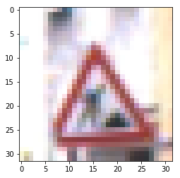


```python

# get number of training entries
no_train = len(X_train)

# get number of testing entries
no_test = len(X_test)

# get number of valid entries
no_valid = len(X_valid)

#get image shape
image_shape = X_train[0].shape

#get unique classes in teh dataset

no_classes = len(np.unique(Y_train))

#print all information

print('No of training entries', no_train)
print('No of training entries - y', len(Y_train))
print('No of testing entries', no_test)
print('No of valid entries', no_valid)

print('No of unique classes', no_classes)
print('image shape is ', image_shape)


```

    No of training entries 34799
    No of training entries - y 34799
    No of testing entries 12630
    No of valid entries 4410
    No of unique classes 43
    image shape is  (32, 32, 3)


```python
# start data visualization


# select random of 10 images
fig, axs = plt.subplots(4,5,figsize =(15,6))
fig.subplots_adjust(hspace=.2,wspace=0.001)
axs = axs.ravel()

for i in range(20):
    index = random.randint(0,len(X_train))
    image = X_train[index]
    axs[i].axis('off')
    axs[i].imshow(image)
    axs[i].set_title(Y_train[index])   


```


```python
# Create histogram of label frequency
hist,bins = np.histogram(Y_train,bins=no_classes)
width=0.7 *(bins[1] - bins[0])
center = (bins[:-1] + bins[1:]) / 2
plt.bar(center,hist,align='center',width=width)
plt.show()
```


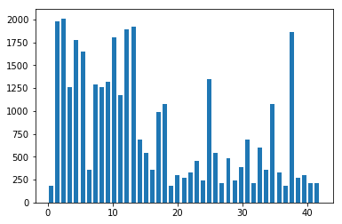


### Design and Test a Model Architecture


### 1. Describe how you preprocessed the image data. What techniques were chosen and why did you choose these techniques? Consider including images showing the output of each preprocessing technique. Pre-processing refers to techniques such as converting to grayscale, normalization, etc. (OPTIONAL: As described in the "Stand Out Suggestions" part of the rubric, if you generated additional data for training, describe why you decided to generate additional data, how you generated the data, and provide example images of the additional data. Then describe the characteristics of the augmented training set like number of images in the set, number of images for each class, etc.)

Following are the pre-processing techniques used in this project:

1. Greyscale  - Images are converted to grey scale to increase the speed and effeciency of the training
2. Check if the data has to be shuffled by printing first 1000 data. Shuffling of the data as the data is in sorted order by classes. Shuffling is required before training
3. Normalization - Data is normalized using the below formula. I believe it helps in training with a single learning rate 
   X_test_normalized = (X_test - X_test_min)/(X_test_max - X_test_min). Though mean is not zero, it is very close to zero compared to the original data setup
4.  functions for data augmentation used are random scaling, random warp, random brightness

### Check the bin count 

[ 0  1  2  3  4  5  6  7  8  9 10 11 12 13 14 15 16 17 18 19 20 21 22 23 24 25 26 27 28 29 30 31 32 33 34 35 36 37 38 39 40 41 42] 
 [ 180 1980 2010 1260 1770 1650  360 1290 1260 1320 1800 1170 1890 1920  690 540  360  990 1080  180  300  270  330  450  240 1350  540  210  480  240  390  690  210  599  360 1080  330  180 1860  270  300  210  210]

Above are the bin count for 43 classes. minimum sample for label is 180.

Check the distribution of the shuffled data to ensure shuffling is proper.

```python

# convert to grey scale

X_train_rgb = X_train
X_train_gry = np.sum(X_train/3, axis=3, keepdims=True)

X_test_rgb = X_test
X_test_gry = np.sum(X_test/3, axis=3, keepdims=True)

X_valid_rgb = X_valid
X_valid_gry = np.sum(X_valid/3, axis=3, keepdims=True)


print('RGB shape:', X_train_rgb.shape)
print('Grayscale shape:', X_train_gry.shape)

#overwrite variables with grey shape

X_train = X_train_gry
X_test = X_test_gry
X_valid = X_valid_gry
```

    RGB shape: (34799, 32, 32, 3)
    Grayscale shape: (34799, 32, 32, 1)


```python
# compare Grey scale and RGB

n_rows = 8
n_cols = 10
offset = 9000
fig, axs = plt.subplots(n_rows,n_cols, figsize=(18, 14))
fig.subplots_adjust(hspace = .1, wspace=.001)
axs = axs.ravel()
for j in range(0,n_rows,2):
    for i in range(n_cols):
        index = i + j*n_cols
        image = X_train_rgb[index + offset]
        axs[index].axis('off')
        axs[index].imshow(image)
    for i in range(n_cols):
        index = i + j*n_cols + n_cols
        image = X_train_gry[index + offset - n_cols].squeeze()
        axs[index].axis('off')
        axs[index].imshow(image, cmap='gray')
```


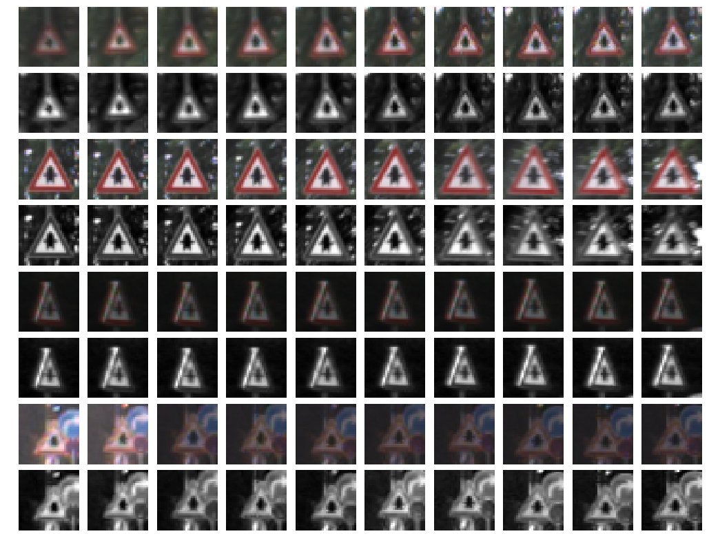


```python
# check if data has to be shuffled

print(np.unique(Y_train))
print(Y_train[0:500])
print(Y_train[501:1000])
```

    [ 0  1  2  3  4  5  6  7  8  9 10 11 12 13 14 15 16 17 18 19 20 21 22 23 24
     25 26 27 28 29 30 31 32 33 34 35 36 37 38 39 40 41 42]
    [41 41 41 41 41 41 41 41 41 41 41 41 41 41 41 41 41 41 41 41 41 41 41 41 41
     41 41 41 41 41 41 41 41 41 41 41 41 41 41 41 41 41 41 41 41 41 41 41 41 41
     41 41 41 41 41 41 41 41 41 41 41 41 41 41 41 41 41 41 41 41 41 41 41 41 41
     41 41 41 41 41 41 41 41 41 41 41 41 41 41 41 41 41 41 41 41 41 41 41 41 41
     41 41 41 41 41 41 41 41 41 41 41 41 41 41 41 41 41 41 41 41 41 41 41 41 41
     41 41 41 41 41 41 41 41 41 41 41 41 41 41 41 41 41 41 41 41 41 41 41 41 41
     41 41 41 41 41 41 41 41 41 41 41 41 41 41 41 41 41 41 41 41 41 41 41 41 41
     41 41 41 41 41 41 41 41 41 41 41 41 41 41 41 41 41 41 41 41 41 41 41 41 41
     41 41 41 41 41 41 41 41 41 41 31 31 31 31 31 31 31 31 31 31 31 31 31 31 31
     31 31 31 31 31 31 31 31 31 31 31 31 31 31 31 31 31 31 31 31 31 31 31 31 31
     31 31 31 31 31 31 31 31 31 31 31 31 31 31 31 31 31 31 31 31 31 31 31 31 31
     31 31 31 31 31 31 31 31 31 31 31 31 31 31 31 31 31 31 31 31 31 31 31 31 31
     31 31 31 31 31 31 31 31 31 31 31 31 31 31 31 31 31 31 31 31 31 31 31 31 31
     31 31 31 31 31 31 31 31 31 31 31 31 31 31 31 31 31 31 31 31 31 31 31 31 31
     31 31 31 31 31 31 31 31 31 31 31 31 31 31 31 31 31 31 31 31 31 31 31 31 31
     31 31 31 31 31 31 31 31 31 31 31 31 31 31 31 31 31 31 31 31 31 31 31 31 31
     31 31 31 31 31 31 31 31 31 31 31 31 31 31 31 31 31 31 31 31 31 31 31 31 31
     31 31 31 31 31 31 31 31 31 31 31 31 31 31 31 31 31 31 31 31 31 31 31 31 31
     31 31 31 31 31 31 31 31 31 31 31 31 31 31 31 31 31 31 31 31 31 31 31 31 31
     31 31 31 31 31 31 31 31 31 31 31 31 31 31 31 31 31 31 31 31 31 31 31 31 31]
    [31 31 31 31 31 31 31 31 31 31 31 31 31 31 31 31 31 31 31 31 31 31 31 31 31
     31 31 31 31 31 31 31 31 31 31 31 31 31 31 31 31 31 31 31 31 31 31 31 31 31
     31 31 31 31 31 31 31 31 31 31 31 31 31 31 31 31 31 31 31 31 31 31 31 31 31
     31 31 31 31 31 31 31 31 31 31 31 31 31 31 31 31 31 31 31 31 31 31 31 31 31
     31 31 31 31 31 31 31 31 31 31 31 31 31 31 31 31 31 31 31 31 31 31 31 31 31
     31 31 31 31 31 31 31 31 31 31 31 31 31 31 31 31 31 31 31 31 31 31 31 31 31
     31 31 31 31 31 31 31 31 31 31 31 31 31 31 31 31 31 31 31 31 31 31 31 31 31
     31 31 31 31 31 31 31 31 31 31 31 31 31 31 31 31 31 31 31 31 31 31 31 31 31
     31 31 31 31 31 31 31 31 31 31 31 31 31 31 31 31 31 31 31 31 31 31 31 31 31
     31 31 31 31 31 31 31 31 31 31 31 31 31 31 31 31 31 31 31 31 31 31 31 31 31
     31 31 31 31 31 31 31 31 31 31 31 31 31 31 31 31 31 31 31 31 31 31 31 31 31
     31 31 31 31 31 31 31 31 31 31 31 31 31 31 31 31 31 31 31 31 31 31 31 31 31
     31 31 31 31 31 31 31 31 31 31 31 31 31 31 31 31 31 31 31 31 31 31 31 31 31
     31 31 31 31 31 31 31 31 31 31 31 31 31 31 31 31 31 31 31 31 31 31 31 31 31
     31 31 31 31 31 31 31 31 31 31 31 31 31 31 31 31 31 31 31 31 31 31 31 31 31
     31 31 31 31 31 31 31 31 31 31 31 31 31 31 31 31 31 31 31 31 31 31 31 31 36
     36 36 36 36 36 36 36 36 36 36 36 36 36 36 36 36 36 36 36 36 36 36 36 36 36
     36 36 36 36 36 36 36 36 36 36 36 36 36 36 36 36 36 36 36 36 36 36 36 36 36
     36 36 36 36 36 36 36 36 36 36 36 36 36 36 36 36 36 36 36 36 36 36 36 36 36
     36 36 36 36 36 36 36 36 36 36 36 36 36 36 36 36 36 36 36 36 36 36 36 36]


```python
X_train_mean = np.mean(X_train)
X_train_std = np.std(X_train)

X_test_mean = np.mean(X_test)
X_test_std = np.std(X_test)

X_valid_mean = np.mean(X_valid)
X_valid_std = np.std(X_valid)


print("mean for X_train", np.mean(X_train))
print("mean for X_test",np.mean(X_test))
print("mean for X_valid",np.mean(X_valid))


print("stddev for X train", np.std(X_train))
print("stdev for X test", np.std(X_test))
print("stdev for X valid", np.std(X_valid))


X_train_normalized = (X_train - X_train_mean)/X_train_std
X_test_normalized = (X_test - X_test_mean)/X_test_std
X_valid_normalized = (X_valid - X_valid_mean)/X_valid_std


print("standardized mean for X_train", np.mean(X_train_normalized))
print("standardized mean for X_test", np.mean(X_test_normalized))
print("standardized mean for X_valid", np.mean(X_valid_normalized))


print("standardized stdev for X_train", np.std(X_train_normalized))
print("standardized stddev for X_test", np.std(X_test_normalized))
print("standardized stddev for X_valid", np.std(X_valid_normalized))

X_train_max = np.max(X_train)
X_train_min = np.min(X_train)
X_train_normalized = (X_train - X_train_min)/(X_train_max - X_train_min)

X_test_max = np.max(X_test)
X_test_min = np.min(X_test)
X_test_normalized = (X_test - X_test_min)/(X_test_max - X_test_min)

X_valid_max = np.max(X_valid)
X_valid_min = np.min(X_valid)
X_valid_normalized = (X_valid - X_valid_min)/(X_valid_max - X_valid_min)

print("Normalized mean for X_train", np.mean(X_train_normalized))
print("Normalized mean for X_test", np.mean(X_test_normalized))
print("Normalized mean for X_valid", np.mean(X_valid_normalized))


print("Normalized stdev for X_train", np.std(X_train_normalized))
print("Normalized stddev for X_test", np.std(X_test_normalized))
print("Normalized stddev for X_valid", np.std(X_valid_normalized))


```

    mean for X_train 82.677589037
    mean for X_test 82.1484603612
    mean for X_valid 83.5564273756
    stddev for X train 66.0097957522
    stdev for X test 66.7642435759
    stdev for X valid 67.9870214471
    standardized mean for X_train 8.21244085217e-16
    standardized mean for X_test 1.58103494227e-15
    standardized mean for X_valid 3.86689924223e-17
    standardized stdev for X_train 1.0
    standardized stddev for X_test 1.0
    standardized stddev for X_valid 1.0
    Normalized mean for X_train 0.314367065134
    Normalized mean for X_test 0.311348447654
    Normalized mean for X_valid 0.314225709503
    Normalized stdev for X_train 0.262638444637
    Normalized stddev for X_test 0.265993002295
    Normalized stddev for X_valid 0.271948085788


```python

# check randmoly few images to check if images are fine


print("Original shape:", X_train.shape)
print("Normalized shape:", X_train_normalized.shape)
for i in range(1,5):
    
    index = random.randint(0,len(X_train_normalized))
    fig, axs = plt.subplots(1,2, figsize=(10, 3))
    axs = axs.ravel()
    axs[0].axis('off')
    axs[0].set_title('normalized')
    axs[0].imshow(X_train_normalized[index].squeeze(), cmap='gray')
    axs[1].axis('off')
    axs[1].set_title('original')
    axs[1].imshow(X_train[index].squeeze(), cmap='gray')

```

    Original shape: (34799, 32, 32, 1)
    Normalized shape: (34799, 32, 32, 1)


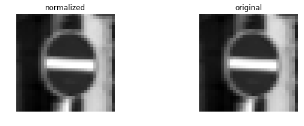


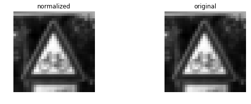


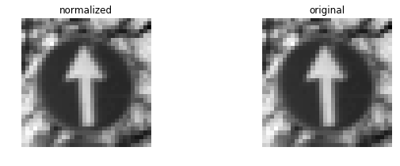


```python
import cv2
print(len(X_train))
print(len(Y_train))

index = random.randint(0,len(X_train))

def random_translate(img):
    rows,cols,_ = img.shape
    # allow translation up to px pixels in x and y directions
    px = 2
    dx,dy = np.random.randint(-px,px,2)
    M = np.float32([[1,0,dx],[0,1,dy]])
    dst = cv2.warpAffine(img,M,(cols,rows))
    dst = dst[:,:,np.newaxis]
    return dst

# test this function
test_img = X_train_normalized[index]
test_dst = random_translate(test_img)
fig, axs = plt.subplots(1,2, figsize=(10, 3))
axs[0].axis('off')
axs[0].imshow(test_img.squeeze(), cmap='gray')
axs[0].set_title('original')
axs[1].axis('off')
axs[1].imshow(test_dst.squeeze(), cmap='gray')
axs[1].set_title('translated')
print('shape in/out:', test_img.shape, test_dst.shape)

def random_scaling(img):
    rows,cols,_ = img.shape
    # transform limits
    px = np.random.randint(-2,2)
    # ending locations
    pts1 = np.float32([[px,px],[rows-px,px],[px,cols-px],[rows-px,cols-px]])
    # starting locations (4 corners)
    pts2 = np.float32([[0,0],[rows,0],[0,cols],[rows,cols]])
    M = cv2.getPerspectiveTransform(pts1,pts2)
    dst = cv2.warpPerspective(img,M,(rows,cols))
    dst = dst[:,:,np.newaxis]
    return dst

test_dst = random_scaling(test_img)
fig, axs = plt.subplots(1,2, figsize=(10, 3))
axs[0].axis('off')
axs[0].imshow(test_img.squeeze(), cmap='gray')
axs[0].set_title('original')
axs[1].axis('off')
axs[1].imshow(test_dst.squeeze(), cmap='gray')
axs[1].set_title('scaled')
print('shape in/out:', test_img.shape, test_dst.shape)
    
def random_warp(img):
    rows,cols,_ = img.shape
    # random scaling coefficients
    rndx = np.random.rand(3) - 0.5
    rndx *= cols * 0.06 # this coefficient determines the degree of warping
    rndy = np.random.rand(3) - 0.5
    rndy *= rows * 0.06
    # 3 starting points for transform, 1/4 way from edges
    x1 = cols/4
    x2 = 3*cols/4
    y1 = rows/4
    y2 = 3*rows/4
    pts1 = np.float32([[y1,x1],
    [y2,x1],
    [y1,x2]])
    pts2 = np.float32([[y1+rndy[0],x1+rndx[0]],
    [y2+rndy[1],x1+rndx[1]],
    [y1+rndy[2],x2+rndx[2]]])
    M = cv2.getAffineTransform(pts1,pts2)
    dst = cv2.warpAffine(img,M,(cols,rows))
    dst = dst[:,:,np.newaxis]
    return dst

test_dst = random_warp(test_img)
fig, axs = plt.subplots(1,2, figsize=(10, 3))
axs[0].axis('off')
axs[0].imshow(test_img.squeeze(), cmap='gray')
axs[0].set_title('original')
axs[1].axis('off')
axs[1].imshow(test_dst.squeeze(), cmap='gray')
axs[1].set_title('warped')
print('shape in/out:', test_img.shape, test_dst.shape)
    

def random_brightness(img):
    shifted = img + 1.0 # shift to (0,2) range
    img_max_value = max(shifted.flatten())
    max_coef = 2.0/img_max_value
    min_coef = max_coef - 0.1
    coef = np.random.uniform(min_coef, max_coef)
    dst = shifted * coef - 1.0
    return dst

test_dst = random_brightness(test_img)
fig, axs = plt.subplots(1,2, figsize=(10, 3))
axs[0].axis('off')
axs[0].imshow(test_img.squeeze(), cmap='gray')
axs[0].set_title('original')
axs[1].axis('off')
axs[1].imshow(test_dst.squeeze(), cmap='gray')
axs[1].set_title('brightness adjusted')
print('shape in/out:', test_img.shape, test_dst.shape)
print(len(X_train))
print(len(Y_train))


```

    34799
    34799
    shape in/out: (32, 32, 1) (32, 32, 1)
    shape in/out: (32, 32, 1) (32, 32, 1)
    shape in/out: (32, 32, 1) (32, 32, 1)
    shape in/out: (32, 32, 1) (32, 32, 1)
    34799
    34799


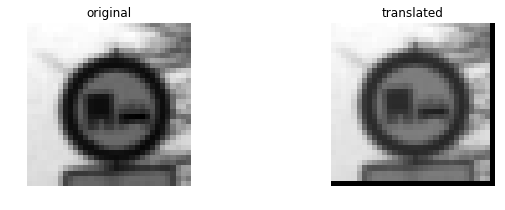


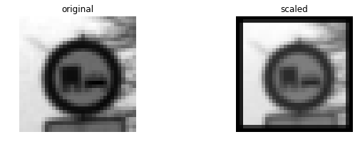


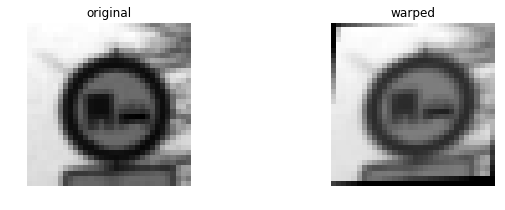


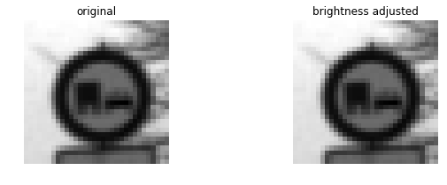


```python
# histogram of label frequency (once again, before data augmentation)
hist, bins = np.histogram(Y_train, bins=no_classes)
width = 0.7 * (bins[1] - bins[0])
center = (bins[:-1] + bins[1:]) / 2
plt.bar(center, hist, align='center', width=width)
plt.show()
```


```python
print(np.unique(Y_train), np.bincount(Y_train))
print("minimum samples for any label:", min(np.bincount(Y_train)))
```

    [ 0  1  2  3  4  5  6  7  8  9 10 11 12 13 14 15 16 17 18 19 20 21 22 23 24
     25 26 27 28 29 30 31 32 33 34 35 36 37 38 39 40 41 42] [ 180 1980 2010 1260 1770 1650  360 1290 1260 1320 1800 1170 1890 1920  690
      540  360  990 1080  180  300  270  330  450  240 1350  540  210  480  240
      390  690  210  599  360 1080  330  180 1860  270  300  210  210]
    minimum samples for any label: 180


```python
print(len(X_train))
print(len(Y_train))
      
print('X, y shapes:', X_train_normalized.shape, Y_train.shape)
input_indices = []
output_indices = []
for class_n in range(no_classes):
    print(class_n, ': ', end='')
    class_indices = np.where(Y_train == class_n)
    n_samples = len(class_indices[0])
    print("no of samples is ", n_samples)
    if n_samples < 600:
        for i in range(600 - n_samples):
            #print('Entered loop')
            input_indices.append(class_indices[0][i%n_samples])
            output_indices.append(X_train_normalized.shape[0])
            new_img = X_train_normalized[class_indices[0][i % n_samples]]
            new_img = random_translate(random_scaling(random_warp(random_brightness(new_img))))
            X_train_normalized = np.concatenate((X_train_normalized, [new_img]), axis=0)
            Y_train = np.concatenate((Y_train, [class_n]), axis=0)
            
    print('')
print('X, y shapes:', X_train_normalized.shape, Y_train.shape)
print(len(X_train))
print(len(Y_train))
print(len(input_indices))
```

    34799
    34799
    X, y shapes: (34799, 32, 32, 1) (34799,)
    0 : no of samples is  180
    
    1 : no of samples is  1980
    
    2 : no of samples is  2010
    
    3 : no of samples is  1260
    
    4 : no of samples is  1770
    
    5 : no of samples is  1650
    
    6 : no of samples is  360
    
    7 : no of samples is  1290
    
    8 : no of samples is  1260
    
    9 : no of samples is  1320
    
    10 : no of samples is  1800
    
    11 : no of samples is  1170
    
    12 : no of samples is  1890
    
    13 : no of samples is  1920
    
    14 : no of samples is  690
    
    15 : no of samples is  540
    
    16 : no of samples is  360
    
    17 : no of samples is  990
    
    18 : no of samples is  1080
    
    19 : no of samples is  180
    
    20 : no of samples is  300
    
    21 : no of samples is  270
    
    22 : no of samples is  330
    
    23 : no of samples is  450
    
    24 : no of samples is  240
    
    25 : no of samples is  1350
    
    26 : no of samples is  540
    
    27 : no of samples is  210
    
    28 : no of samples is  480
    
    29 : no of samples is  240
    
    30 : no of samples is  390
    
    31 : no of samples is  690
    
    32 : no of samples is  210
    
    33 : no of samples is  599
    
    34 : no of samples is  360
    
    35 : no of samples is  1080
    
    36 : no of samples is  330
    
    37 : no of samples is  180
    
    38 : no of samples is  1860
    
    39 : no of samples is  270
    
    40 : no of samples is  300
    
    41 : no of samples is  210
    
    42 : no of samples is  210
    
    X, y shapes: (41460, 32, 32, 1) (41460,)
    34799
    41460
    6661


```python
print(len(X_train_normalized))
print("train normalized mean is", np.mean(X_train_normalized))
```

    41460
    train normalized mean is 0.329363257175


```python
print(len(X_train))
print(len(Y_train))
choices = list(range(len(input_indices)))
picks = []
for i in range(5):
    rnd_index = np.random.randint(low=0,high=len(choices))
    picks.append(choices.pop(rnd_index))
fig, axs = plt.subplots(2,5, figsize=(15, 6))
fig.subplots_adjust(hspace = .2, wspace=.001)
axs = axs.ravel()
for i in range(5):
    image = X_train_normalized[input_indices[picks[i]]].squeeze()
    axs[i].axis('off')
    axs[i].imshow(image, cmap = 'gray')
    axs[i].set_title(Y_train[input_indices[picks[i]]])
for i in range(5):
    image = X_train_normalized[output_indices[picks[i]]].squeeze()
    axs[i+5].axis('off')
    axs[i+5].imshow(image, cmap = 'gray')
    axs[i+5].set_title(Y_train[output_indices[picks[i]]])
```

    34799
    41460


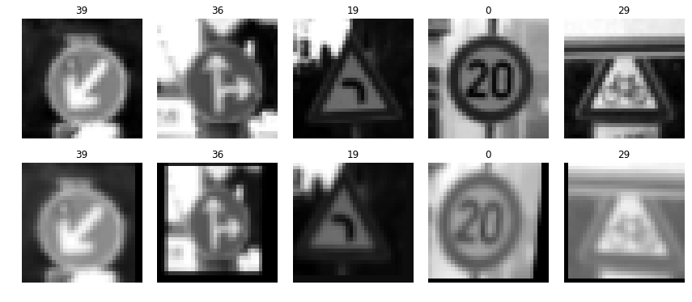


```python
print(len(input_indices))
```

    6661


```python
# histogram of label frequency
hist, bins = np.histogram(Y_train, bins=no_classes)
width = 0.7 * (bins[1] - bins[0])
center = (bins[:-1] + bins[1:]) / 2
plt.bar(center, hist, align='center', width=width)
plt.show()
```


```python
## Shuffle the training dataset
from sklearn.utils import shuffle
X_train_normalized, Y_train = shuffle(X_train_normalized, Y_train)
X_train = X_train_normalized
print('done')

X_test_normalized, Y_test = shuffle(X_test_normalized, Y_test)
X_test = X_test_normalized
print('done')

X_valid_normalized, Y_valid = shuffle(X_valid_normalized, Y_valid)
X_valid = X_valid_normalized
print('done')


# check if data has to be shuffled

print(np.unique(Y_train))
print(Y_train[0:500])
print(Y_train[501:1000])
```

    done
    done
    done
    [ 0  1  2  3  4  5  6  7  8  9 10 11 12 13 14 15 16 17 18 19 20 21 22 23 24
     25 26 27 28 29 30 31 32 33 34 35 36 37 38 39 40 41 42]
    [ 7  0 31  9 31 23 38 25  5 10  1 10 13 21 25 34 10 33 12  9 35 13  6 37 38
     13  4  9 28 24 27 13 26 11 10 40 35 23  4  1  9  0  8 41 19  2  9 16 28  7
      8 37 11 30  0  9  5 10 23 20 26 25 13  8 13 10  2 13 40  1 36 30 32 17 34
     14 37 10 17 25 18 12 19 35 10 17 33  9 32 42 28  8 25 10  1 12 34  3 32  6
     37 27 12 26 38 26  6  0  3 37  7 29  3 38  2 15 32 31  5  0  1 14  9 13 35
     12 41 30  1  6 22 29 21 12 11 38  2  2  7 12 38 35 10 13 38 29 18  2 31 10
     35  4 35 13 22  5 23 13  4  8  1 11  2 38 36 11 29  9 24 12  7 13 16 37  5
      2  9 21  3 42 38  3 42  2 18 35 18 37 19 26 12 13 16 41  7 42  3 34 38  2
     14 38  1 18 18  4 13 12  3  5 38 22 11 10 12 24  1 25 23 24 39  6 24  3 34
     31 30 23 33  5 30 38 13 30 41  3 30 25 35 14 34  4  2 29 26 20  4 30 34 40
     12 38  6 33  4 29  8 42  1  2  2 21 36 30 28 39 38 39 36  5 17 36 13 10 13
     34  2 24 38 11 18 19  8 38 10 10  6 26 18  0 27  5 40 11 42 13 10 29 20  4
     30 22 42 12  1  1 12 13 25  5  8 21 33 17 25 30  7  9  7 13 22 12  9 21 24
     42 25 10 29 37  7 17 36  7 18 36 26 18 34 41 29  4 40 23 10 17 13  5 11 42
     25 18  7 22 42  1 26 11 38 18  7 13 16  1 14 22 26  6 40 25  7  4 39  1 38
     16 19  9 26  2 29 15 18 12 31  8  4  1  4 20 17 41  5  3 23  1  5 10  4 14
     18 16  2  1  2 39 14 33 32 13 17  9 10 17  2 16 22 16 17 24 22  3 16  2 24
      8  9 13 41  3 32 10 35  9  9 16  5 33  1  9 30 13 38 27  2 37 11 14  5 24
     22 42 12 36  5 28 10 41 21  2  7 10 30 25 41  1  9 11  8  1 13 14  9 33 36
     16 24  5  8 39  2 18  4 35 15  2 12 13  1 18 13 28 28  3 16 19 31  7 38  7]
    [25 13 17 29  1 13 26  1 37  8 21  2 19 16 10  7 25  1 32 12 38  7  1  6 13
     42 10 41 29 38 35 42 10 37 33 24 18 33  1 41  5 24 12 23  2 13 38 25 10 18
     38 13 25  5 38 31 13  2 42 16 11  3  6 13  1  7 11  5  6  2 18  3 14 28  6
      8  7  4 28 38 12 26 12 34 35  3  7  8 18 17 10  7  7 31 14  4  9 26 20  5
     18  2  4 15 38 33 12 34 14  1 32  3  5 35  2 31  1 38  4 27  5 23 12  2  5
     38  4  2 18 17  3  9  1 25 24  1  8 41 40  2  5  7 12  1 12  1 41 13 23 26
     13  8 25  2  8  9  8 32 13 34 36 10 34 10  8  1 20 36 13  4  9  7 25  8  3
     38  1  1  4 12 28 36 25  0  5  3 41 38  5  1  8 22  4 17 33 27  2 33  6  4
      3 36  8  5 38  2 42  7 40 25  6 13 38 21 27 17  5  9  2 25  7  7 22 38 20
     37  1  4  4  1 13 31  0  5 10 12  6 38 40  4  4 31 37 25  4  1 17 14 26  7
     23  3 33 34  5 42 13 13 10 18 10  4  2 38 21 10  6 18 18 18  2 18 26  5 12
      2 28 26  1 32 14 22 11  6 27 17 38 17 30  4 17 10 38  2 14  0 20 31 38  2
     11 31  4  3  4 17 25 24 30 42  9  8 20 15  2  7 25  1 38  1  9 10  0  1 21
     41 35 38 31 25 10 10  4  5  3 17  0  9 12 34 37 31 32 36 36 41  2 13 16 13
      9  1 42 37 20 39 38 18 13  2  1  7  4 11 23  4 32 11 18 18 28  1 10 12 40
      1  5 11  8 17 12  7 36 10 39  8  4 13 41  1 25 17 18  8 37 11 13  2 26 13
     15 10 38  9  9  7 15  4 13 14  1  4  8 16  3 42  8 18  2  2  4 38 16 18 27
     34  5  8 27  1 22 36 22 16 29 19 35  5  2 36 14 34 18 13 13 34 38 18 22  2
      9 37  1 22 10 23  5 13 35 13 30 32  6 10  8 11 17 35 20 36  2  4  9 17  2
     10 11 11 32  9  8 33 29  7 11 10 28 32 31  2 16 10 13 10  1 40  4 27  7]


#### 2. Describe what your final model architecture looks like including model type, layers, layer sizes, connectivity, etc.) Consider including a diagram and/or table describing the final model.

The Convolution neural network Architecture consists of following five layers:

#####   Layer 1: Convolutional layer with Input as 32x32x1 and Output as 28x28x6 with a RELU activation function followed a 		pooling with input as 28x28x6 and Output as 14x14x6.

#####   Layer 2: Output of Layer 1 as input to Convolutional layer with output as 10x10x16 and with a RELU activation function         followed a pooling with input as 10x10x16 and flattened Output as 5x5x16 

#####   Layer 3: Output of Layer 2 input to fully connected layer followed by RELU activation function. Also implemented drop 		out in layer 3 to increase the accuracy. Accuracy increased from 92% to 95% with drop out

#####   Layer 4: output of Layer 3 to fully connected layer followed by RELU activation function with dropout. Output = 84.
   
#####    Layer 5: Fully connected layer with input of 84 and output as 10 that returns the final logits

  
```python
import tensorflow as tf
EPOCHS = 52
BATCH_SIZE = 84
print('done')
```

    done


```python
from tensorflow.contrib.layers import flatten
def LeNet(x):    
    # Arguments used for tf.truncated_normal, randomly defines variables for the weights and biases for each layer
    mu = 0
    sigma = 0.1
    
    # SOLUTION: Layer 1: Convolutional. Input = 32x32x1. Output = 28x28x6.
    conv1_W = tf.Variable(tf.truncated_normal(shape=(5, 5, 1, 6), mean = mu, stddev = sigma))
    conv1_b = tf.Variable(tf.zeros(6))
    conv1   = tf.nn.conv2d(x, conv1_W, strides=[1, 1, 1, 1], padding='VALID') + conv1_b

    # SOLUTION: Activation.
    conv1 = tf.nn.relu(conv1)

    # SOLUTION: Pooling. Input = 28x28x6. Output = 14x14x6.
    conv1 = tf.nn.max_pool(conv1, ksize=[1, 2, 2, 1], strides=[1, 2, 2, 1], padding='VALID')

    # SOLUTION: Layer 2: Convolutional. Output = 10x10x16.
    conv2_W = tf.Variable(tf.truncated_normal(shape=(5, 5, 6, 16), mean = mu, stddev = sigma))
    conv2_b = tf.Variable(tf.zeros(16))
    conv2   = tf.nn.conv2d(conv1, conv2_W, strides=[1, 1, 1, 1], padding='VALID') + conv2_b
    
    # SOLUTION: Activation.
    conv2 = tf.nn.relu(conv2)

    # SOLUTION: Pooling. Input = 10x10x16. Output = 5x5x16.
    conv2 = tf.nn.max_pool(conv2, ksize=[1, 2, 2, 1], strides=[1, 2, 2, 1], padding='VALID')

    # SOLUTION: Flatten. Input = 5x5x16. Output = 400.
    fc0   = flatten(conv2)
    
    # SOLUTION: Layer 3: Fully Connected. Input = 400. Output = 120.
    fc1_W = tf.Variable(tf.truncated_normal(shape=(400, 120), mean = mu, stddev = sigma))
    fc1_b = tf.Variable(tf.zeros(120))
    fc1   = tf.matmul(fc0, fc1_W) + fc1_b
    
    # SOLUTION: Activation.
    fc1    = tf.nn.relu(fc1)
    fc1    = tf.nn.dropout(fc1,keep_prob)

    # SOLUTION: Layer 4: Fully Connected. Input = 120. Output = 84.
    fc2_W  = tf.Variable(tf.truncated_normal(shape=(120, 84), mean = mu, stddev = sigma))
    fc2_b  = tf.Variable(tf.zeros(84))
    fc2    = tf.matmul(fc1, fc2_W) + fc2_b
    
    # SOLUTION: Activation.
    fc2    = tf.nn.relu(fc2)
    fc2    = tf.nn.dropout(fc2,keep_prob)

    # SOLUTION: Layer 5: Fully Connected. Input = 84. Output = 10.
    fc3_W  = tf.Variable(tf.truncated_normal(shape=(84, 43), mean = mu, stddev = sigma))
    fc3_b  = tf.Variable(tf.zeros(43))
    logits = tf.matmul(fc2, fc3_W) + fc3_b
    
    return logits
print('done')
```

    done


```python
x = tf.placeholder(tf.float32,(None,32,32,1))
y = tf.placeholder(tf.int32,(None))
keep_prob  = tf.placeholder(tf.float32)
one_hot_y = tf.one_hot(y,43)
print('done')

```

    done


#### 3. Describe how you trained your model. The discussion can include the type of optimizer, the batch size, number of epochs and any hyperparameters such as learning rate.

I used a batch size of 84 and Epochs of 52. I started with a batch size of 128 and epochs of 40, but the accuracy was very less. so increase the Epochs and reduced the batch size and results were better.

Used a learning rate of .0009

Following are the results with and without drop out with different batch size and Epochs.

Without drop out				without drop out			with drop out
EPOCHS = 40					EPOCHS = 52				EPOCHS = 52
BATCH_SIZE = 128				BATCH_SIZE = 84				BATCH_SIZE = 84
				
Training...					Training...				Training...
EPOCH 1 ...					EPOCH 1 ...				EPOCH 1 ...
Validation Accuracy = 0.712			Validation Accuracy = 0.702		Validation Accuracy = 0.571
				
EPOCH 2 ...					EPOCH 2 ...				EPOCH 2 ...
Validation Accuracy = 0.810			Validation Accuracy = 0.790		Validation Accuracy = 0.765
				
EPOCH 3 ...					EPOCH 3 ...				EPOCH 3 ...
Validation Accuracy = 0.837			Validation Accuracy = 0.838		Validation Accuracy = 0.849
				
EPOCH 4 ...					EPOCH 4 ...				EPOCH 4 ...
Validation Accuracy = 0.881			Validation Accuracy = 0.847		Validation Accuracy = 0.848
				
EPOCH 5 ...					EPOCH 5 ...				EPOCH 5 ...
Validation Accuracy = 0.872			Validation Accuracy = 0.874		Validation Accuracy = 0.882
				
---------------------------------------------------------------------------------------------------
				
EPOCH 40 ...					EPOCH 40 ...				EPOCH 40 ...
Validation Accuracy = 0.910			Validation Accuracy = 0.929		Validation Accuracy = 0.964
				
Model saved					EPOCH 41 ...				EPOCH 41 ...
						Validation Accuracy = 0.925		Validation Accuracy = 0.964
						EPOCH 52 ...				EPOCH 52 ...
						Validation Accuracy = 0.928		Validation Accuracy = 0.967
						Model saved				Model saved


```python
rate = 0.0009
logits = LeNet(x)
cross_entropy = tf.nn.softmax_cross_entropy_with_logits(labels=one_hot_y, logits=logits)
loss_operation = tf.reduce_mean(cross_entropy)
optimizer = tf.train.AdamOptimizer(learning_rate = rate)
training_operation = optimizer.minimize(loss_operation)
```


```python
correct_prediction = tf.equal(tf.argmax(logits, 1), tf.argmax(one_hot_y, 1))
accuracy_operation = tf.reduce_mean(tf.cast(correct_prediction, tf.float32))
saver = tf.train.Saver()


```


```python
def evaluate(X_data, y_data):
    num_examples = len(X_data)
    total_accuracy = 0
    sess = tf.get_default_session()
    for offset in range(0, num_examples, BATCH_SIZE):
        batch_x, batch_y = X_data[offset:offset+BATCH_SIZE], y_data[offset:offset+BATCH_SIZE]
        accuracy = sess.run(accuracy_operation, feed_dict={x: batch_x, y: batch_y, keep_prob: 1.0})
        total_accuracy += (accuracy * len(batch_x))
    return total_accuracy / num_examples
print('done')


```

    done

#### 4. Describe the approach taken for finding a solution and getting the validation set accuracy to be at least 0.93. Include in the discussion the results on the training, validation and test sets and where in the code these were calculated. Your approach may have been an iterative process, in which case, outline the steps you took to get to the final solution and why you chose those steps. Perhaps your solution involved an already well known implementation or architecture. In this case, discuss why you think the architecture is suitable for the current problem.

My final model has validation accuracy of 96.4% and test accuracy of 94.5%.  This is the best result that i could obtained by tweaking BATCH SIZE, EPOCHS and learning rate.


```python
with tf.Session() as sess:
    sess.run(tf.global_variables_initializer())
    num_examples = len(X_train)
    print("Training...")
 
   
   
    for i in range(EPOCHS):
        X_train, Y_train = shuffle(X_train, Y_train)
        for offset in range(0, num_examples, BATCH_SIZE):
            end = offset + BATCH_SIZE
            batch_x, batch_y = X_train[offset:end], Y_train[offset:end]
            sess.run(training_operation, feed_dict={x: batch_x, y: batch_y, keep_prob: 0.5})
        validation_accuracy = evaluate(X_valid, Y_valid)
        print("EPOCH {} ...".format(i+1))
        print("Validation Accuracy = {:.3f}".format(validation_accuracy))
        print()
    saver.save(sess, 'lenet')
    print("Model saved")
```

    Training...
    EPOCH 1 ...
    Validation Accuracy = 0.657
    
    EPOCH 2 ...
    Validation Accuracy = 0.810
    
    EPOCH 3 ...
    Validation Accuracy = 0.852
    
    EPOCH 4 ...
    Validation Accuracy = 0.869
    
    EPOCH 5 ...
    Validation Accuracy = 0.887
    
    EPOCH 6 ...
    Validation Accuracy = 0.899
    
    EPOCH 7 ...
    Validation Accuracy = 0.920
    
    EPOCH 8 ...
    Validation Accuracy = 0.924
    
    EPOCH 9 ...
    Validation Accuracy = 0.930
    
    EPOCH 10 ...
    Validation Accuracy = 0.928
    
    EPOCH 11 ...
    Validation Accuracy = 0.937
    
    EPOCH 12 ...
    Validation Accuracy = 0.951
    
    EPOCH 13 ...
    Validation Accuracy = 0.947
    
    EPOCH 14 ...
    Validation Accuracy = 0.951
    
    EPOCH 15 ...
    Validation Accuracy = 0.954
    
    EPOCH 16 ...
    Validation Accuracy = 0.948
    
    EPOCH 17 ...
    Validation Accuracy = 0.954
    
    EPOCH 18 ...
    Validation Accuracy = 0.956
    
    EPOCH 19 ...
    Validation Accuracy = 0.957
    
    EPOCH 20 ...
    Validation Accuracy = 0.957
    
    EPOCH 21 ...
    Validation Accuracy = 0.955
    
    EPOCH 22 ...
    Validation Accuracy = 0.954
    
    EPOCH 23 ...
    Validation Accuracy = 0.960
    
    EPOCH 24 ...
    Validation Accuracy = 0.957
    
    EPOCH 25 ...
    Validation Accuracy = 0.959
    
    EPOCH 26 ...
    Validation Accuracy = 0.961
    
    EPOCH 27 ...
    Validation Accuracy = 0.961
    
    EPOCH 28 ...
    Validation Accuracy = 0.965
    
    EPOCH 29 ...
    Validation Accuracy = 0.965
    
    EPOCH 30 ...
    Validation Accuracy = 0.962
    
    EPOCH 31 ...
    Validation Accuracy = 0.969
    
    EPOCH 32 ...
    Validation Accuracy = 0.963
    
    EPOCH 33 ...
    Validation Accuracy = 0.964
    
    EPOCH 34 ...
    Validation Accuracy = 0.968
    
    EPOCH 35 ...
    Validation Accuracy = 0.961
    
    EPOCH 36 ...
    Validation Accuracy = 0.969
    
    EPOCH 37 ...
    Validation Accuracy = 0.967
    
    EPOCH 38 ...
    Validation Accuracy = 0.960
    
    EPOCH 39 ...
    Validation Accuracy = 0.963
    
    EPOCH 40 ...
    Validation Accuracy = 0.963
    
    EPOCH 41 ...
    Validation Accuracy = 0.966
    
    EPOCH 42 ...
    Validation Accuracy = 0.963
    
    EPOCH 43 ...
    Validation Accuracy = 0.966
    
    EPOCH 44 ...
    Validation Accuracy = 0.964
    
    EPOCH 45 ...
    Validation Accuracy = 0.963
    
    EPOCH 46 ...
    Validation Accuracy = 0.966
    
    EPOCH 47 ...
    Validation Accuracy = 0.962
    
    EPOCH 48 ...
    Validation Accuracy = 0.965
    
    EPOCH 49 ...
    Validation Accuracy = 0.966
    
    EPOCH 50 ...
    Validation Accuracy = 0.973
    
    EPOCH 51 ...
    Validation Accuracy = 0.966
    
    EPOCH 52 ...
    Validation Accuracy = 0.964
    
    Model saved


```python
with tf.Session() as sess:
    saver.restore(sess, tf.train.latest_checkpoint('.'))

    test_accuracy = evaluate(X_test, Y_test)
    print("Test Accuracy = {:.3f}".format(test_accuracy))
```

    Test Accuracy = 0.945


### Test a Model on New Images

#### 1. Choose five German traffic signs found on the web and provide them in the report. For each image, discuss what quality or qualities might be difficult to classify.

I downloaded various PNG and GIF files from internet. However the difficulty was in obtaining the images with consistent shape. I downloaded two set of images and tested them separately and the model was able to identify the images.


```python
# now test with new images

import os
import matplotlib.image as mpimg
import matplotlib.pyplot as plt
import cv2
import numpy as np
import csv


#enable inline visualization
%matplotlib inline

#folder_name = 'images1/'
#img_labels = np.array([22,35,18,1,18,18,1])

folder_name='images2/'
img_labels = np.array([22,35,15,18,1,37])


print(folder_name)


get_label = np.genfromtxt('data/signnames.csv', skip_header=1, dtype=[('myint','i8'), ('mystring','S55')],
delimiter=',')

fig, axs = plt.subplots(2,5, figsize=(4, 2))
fig.subplots_adjust(hspace = .2, wspace=.001)
axs = axs.ravel()

index = 0
my_images = []


labels = {}

#22 - bumpy road
#35 - Ahead only
#18 - General caution
#1 - 30 kms per hour
#15 - No vehicles
#37- go straight or left

for i, img in enumerate(os.listdir(folder_name)):
    if img[-3:] in ('png', 'jpg'):
        image = cv2.imread(folder_name + img)
        axs[index].axis('off')
        axs[index].imshow(cv2.cvtColor(image, cv2.COLOR_BGR2RGB))
        print('index is ', index)
        labels[index]= get_label[img_labels[index]][1].decode('ascii')
        print('label index is ', labels[index])
        print(folder_name + img)
        my_images.append(image)
        index = index + 1

my_images = np.asarray(my_images)
                        
my_images_gry = np.sum(my_images/3, axis=3, keepdims=True)
                        
my_images_normalized = (my_images_gry - 128)/128
                        
print(my_images_normalized.shape)

```

    images2/
    index is  0
    label index is  Bumpy road
    images2/2.png
    index is  1
    label index is  Ahead only
    images2/3.png
    index is  2
    label index is  No vehicles
    images2/4.png
    index is  3
    label index is  General caution
    images2/6.png
    index is  4
    label index is  Speed limit (30km/h)
    images2/1.png
    index is  5
    label index is  Go straight or left
    images2/5.png
    (6, 32, 32, 1)


#### 2. Discuss the model's predictions on these new traffic signs and compare the results to predicting on the test set. At a minimum, discuss what the predictions were, the accuracy on these new predictions, and compare the accuracy to the accuracy on the test set (OPTIONAL: Discuss the results in more detail as described in the "Stand Out Suggestions" part of the rubric).

The model was able to accurately predict the results as shown below. I have given below the overall accuracy as well as the accuracy for each of these images


```python
# test the new images
with tf.Session() as sess:
    sess.run(tf.global_variables_initializer())
    # saver = tf.train.import_meta_graph('./lenet.meta')
    #saver.restore(sess, "./lenet")
    saver.restore(sess, tf.train.latest_checkpoint('.'))
    my_accuracy = evaluate(my_images_normalized, img_labels)
    print("My Data Set Accuracy = {:.3f}".format(my_accuracy))
```

    My Data Set Accuracy = 1.000


```python
# test each images

single_image = []
single_image_label = []
no_of_images = 6

for index in range(no_of_images):
    print("current index is ", index)
    single_image = []
    single_image_label = []
    single_image.append(my_images_normalized[index])
    single_image_label.append(img_labels[index])
    print(len(single_image))
    print(len(single_image_label))
    
    with tf.Session() as sess:
        sess.run(tf.global_variables_initializer())
        # saver.restore(sess, "./lenet")
        saver.restore(sess, tf.train.latest_checkpoint('.'))
        model_accuracy = evaluate(single_image, single_image_label)
        print('Image {}'.format(index+1))
        print("Image Accuracy = {:.3f}".format(my_accuracy))
        print()
        
```

    current index is  0
    1
    1
    Image 1
    Image Accuracy = 1.000
    
    current index is  1
    1
    1
    Image 2
    Image Accuracy = 1.000
    
    current index is  2
    1
    1
    Image 3
    Image Accuracy = 1.000
    
    current index is  3
    1
    1
    Image 4
    Image Accuracy = 1.000
    
    current index is  4
    1
    1
    Image 5
    Image Accuracy = 1.000
    
    current index is  5
    1
    1
    Image 6
    Image Accuracy = 1.000
    
#### 3. Describe how certain the model is when predicting on each of the five new images by looking at the softmax probabilities for each prediction. Provide the top 5 softmax probabilities for each image along with the sign type of each probability. (OPTIONAL: as described in the "Stand Out Suggestions" part of the rubric, visualizations can also be provided such as bar charts)

The Top 5 softmax probabilities are given below.

Image/Probability --?     1			2		3		4		5
Bumpy road	 	1.00000000e+00,   1.13607684e-18,   2.77682011e-20,  3.19724472e-21,   2.99252838e-23
Ahead only          	1.00000000e+00,   1.19742632e-10,   1.18682304e-11,  5.34357714e-12,   1.61243360e-12
No Vehicles    		9.99940276e-01,   3.90479836e-05,   8.22237689e-06,  5.98722590e-06,   4.44473517e-06
General Caution		1.00000000e+00,   5.54507640e-36,   4.23992863e-36,  0.00000000e+00,   0.00000000e+00
Speed limit 30km/h	9.97676194e-01,   2.32379045e-03,   3.97210975e-08,  6.98274424e-11,   5.58187512e-15
Go straight or left	1.00000000e+00,   1.91925630e-18,   7.73841745e-20,  3.46975026e-24,   1.37621765e-24
		
Matched images		22, 29, 26, 25, 28
          		35, 34, 36,  9,  3
           		15, 38, 14, 12, 34
           		18, 26, 27,  0,  1
           		1,  4, 14, 40,  2
           		37, 40, 35, 29, 22
			
Label definitions:
#22 - bumpy road
#35 - Ahead only
#18 - General caution
#1 - 30 kms per hour
#15 - No vehicles
#37- go straight or left


```python
#define all required inputs/function
k_size = 5 # top 5 softmax output
softmax_logits = tf.nn.softmax(logits)
top_k = tf.nn.top_k(softmax_logits, k = k_size)

with tf.Session() as sess:
    sess.run(tf.global_variables_initializer())
    saver.restore(sess, tf.train.latest_checkpoint('.'))
    my_softmax_logits = sess.run(softmax_logits, feed_dict={x: my_images_normalized, keep_prob: 1.0})
    my_top_k = sess.run(top_k, feed_dict={x: my_images_normalized, keep_prob: 1.0})
    print(my_top_k)
    
```

    TopKV2(values=array([[  1.00000000e+00,   1.13607684e-18,   2.77682011e-20,
              3.19724472e-21,   2.99252838e-23],
           [  1.00000000e+00,   1.19742632e-10,   1.18682304e-11,
              5.34357714e-12,   1.61243360e-12],
           [  9.99940276e-01,   3.90479836e-05,   8.22237689e-06,
              5.98722590e-06,   4.44473517e-06],
           [  1.00000000e+00,   5.54507640e-36,   4.23992863e-36,
              0.00000000e+00,   0.00000000e+00],
           [  9.97676194e-01,   2.32379045e-03,   3.97210975e-08,
              6.98274424e-11,   5.58187512e-15],
           [  1.00000000e+00,   1.91925630e-18,   7.73841745e-20,
              3.46975026e-24,   1.37621765e-24]], dtype=float32), indices=array([[22, 29, 26, 25, 28],
           [35, 34, 36,  9,  3],
           [15, 38, 14, 12, 34],
           [18, 26, 27,  0,  1],
           [ 1,  4, 14, 40,  2],
           [37, 40, 35, 29, 22]], dtype=int32))


```python

```
